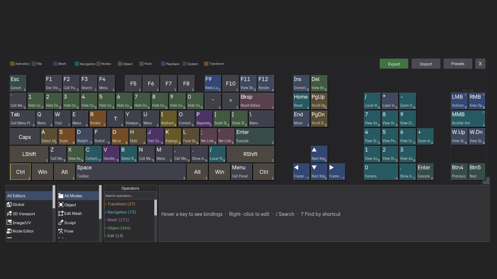

# blenderKey — Keymap Visualizer for Blender

> [!WARNING]
> **Back up your Blender preferences before using this add-on.**
> Keymaps are sensitive user data and Blender provides limited safeguards around them. This add-on edits your keymaps in place — there is a real possibility of keymap loss or corruption, with no guaranteed way for users to restore them from within Blender. Before using this add-on, copy your `userpref.blend` (and any `keyconfig` files) from your Blender config folder so you can roll back if anything goes wrong.

Blender's shortcut system is powerful, but the built-in keymap editor makes you dig through nested menus to find anything. **blenderKey** shows you the whole keyboard on one screen: every shortcut on every key, color-coded, searchable, rebindable with a right-click.

Hover a key to see what it does. Click once to lock it. Right-click to change it. Press a shortcut to jump to the key that owns it. Save your setup as a preset and share it with your team.

> *Completely vibecoded using Claude Code.*

 



---

## Why use it?

- **See every shortcut at a glance.** The whole keyboard is rendered on-screen with each key colored by what it does.
- **Rebind without hunting.** Right-click any key, pick a binding, press a new combo. Done.
- **Find keys by shortcut.** Press `?` then the combo — the key highlights and the panel shows its bindings.
- **Find shortcuts by name.** Press `/` and start typing. Matching keys stay bright, others dim.
- **See what you've changed.** Press `D` and Blender defaults appear in red/green/neutral.
- **Undo anything.** Up to 50 steps, `Ctrl+Z` like you'd expect.
- **Save your setup.** Presets as JSON, export as a Blender `.py` keyconfig, or paste from clipboard.

---

## The keyboard

A GPU-rendered keyboard with drop shadows and smooth hover animations. It's not a screenshot — it's interactive.

- **6 sizes**: 100% full, 96% compact, 80% TKL, 75%, 65%, 60%
- **2 physical layouts**: ANSI or ISO (proper ISO Enter shape)
- **7 logical layouts**: auto-detect your OS, or force QWERTY / AZERTY / QWERTZ / Dvorak / Colemak / Nordic
- **Resizable**: drag the handle, scale 0.5× to 3×
- **All the keys**: alphanumeric, navigation cluster, numpad, function row, mouse buttons (LMB/RMB/MMB)

### What key colors mean

Each key changes appearance based on what's happening:

- **Unbound** — plain surface
- **Bound** — highlighted
- **Category-colored** — tinted by what it does (Transform = amber, Navigation = teal, Mesh = purple, etc.)
- **Hovered** — soft animated transition
- **Selected** — accent color when clicked
- **Modifier-active** — Ctrl/Shift/Alt/OS keys pulse at 2Hz when you hold them physically
- **Dimmed** — during search, non-matches fade to 30%
- **Diff mode** — green for modified bindings, red for deactivated, dim for untouched
- **Rebind flash** — green pulse when you successfully reassign a key

### Badges on each key

- **Top-left** — the physical key name (`G`, `Tab`, `F5`)
- **Bottom** — the primary operator, abbreviated (`Move`, `Extrude`, `Loop Cut`) using 80 built-in shorthand labels
- **Bottom-right** — count of other modifier combos that also have bindings
- **Top-right "D"** — shown when the key has click-drag bindings

Text color adapts to background luminance (WCAG-aware) so labels stay readable on any theme.

---

## Info panel

Pick a key — the right-hand panel shows everything bound to it:

- Every binding with its modifier prefix, operator name, editor icon, and keymap
- Same operator in multiple keymaps? Grouped into one expandable row
- Expand a group to see operator descriptions
- Modal shortcut hints for chain combos (`G G → Edge Slide`, `S S → Shrink-Fatten`, `R R → Trackball`)
- Scrollable — wheel or middle-drag, with a real scrollbar and fade gradients

Nothing selected? The panel shows contextual help and tooltips instead.

---

## Filters

Two side panels to narrow down what you see:

- **Editors** — All, Global, 3D Viewport, Image/UV, Node Editor, Text Editor, Sequencer, Clip, Dopesheet, Graph, NLA, Properties, Outliner, Console, Spreadsheet
- **Modes** — All, Object, Edit Mesh, Sculpt, Pose, Weight Paint, Vertex Paint, Texture Paint, Grease Pencil, Curves

Multi-select. Mix and match. Icons for everything.

---

## Operator browser

A searchable accordion on the left lists every Blender operator, grouped into 13 categories:

Transform • Navigation • Mesh • Object • Edit • Sculpt • Paint • UV • Nodes • Animation • Playback • File • System

- Type in the search to filter by name or idname — categories auto-expand
- Blue dot marks operators that are actually bound somewhere
- Click any operator to:
  - **Assign Shortcut** — press a key combo to bind it
  - **View Bindings** — jump to the key it's already on
  - **Remove All Bindings** — unbind everywhere (undoable)
  - **Open in Preferences** — jump to Blender's built-in editor

---

## Editing shortcuts

### Right-click any key

Opens a menu listing up to 5 bindings on that key. Hover any binding for a sub-menu:

- **Rebind** — press a new combo
- **Unbind / Enable** — toggle it off or back on
- **Reset to Default** — restore Blender's original
- All undoable

### Capture mode

When you rebind, every other key dims and your target pulses with an animated border. The prompt says "Press new key combination… ESC to cancel". Press any combo — letters, digits, F-keys, Tab, Space, arrows, numpad, punctuation, with any mix of Ctrl/Shift/Alt/OS.

### Conflict resolution

If your new combo is already taken, a centered dialog appears with three options:

- **Swap** — move the conflicting binding to the old key
- **Override** — take the combo, deactivate the conflict
- **Cancel** — bail out

---

## Search

Two kinds, different keys:

- **By name** — `/` or `Ctrl+F`. Fuzzy token matching on operator names. Matching keys stay bright, others dim to 30%. Result count shown.
- **By shortcut** — `?` (Shift+/). Press a key combo — the visualizer jumps to that key and shows its bindings.

---

## Diff view

Press `D`. Compares your current keyconfig against Blender defaults:

- **Green** — you modified this binding
- **Red** — you deactivated this binding
- **Dim** — untouched

A "DIFF" badge appears in the toolbar while active.

---

## Undo, redo, presets, export, import

- **Undo** up to 50 levels. `Ctrl+Z` / `Ctrl+Shift+Z`. Every rebind, unbind, reset, toggle, preset-load and import pushes a snapshot.
- **Presets** — save your whole keyconfig as a JSON file. Load, delete, copy to clipboard, paste from clipboard. Location configurable in preferences.
- **Export** — write a Blender-importable `.py` keyconfig script. Export only what you changed (default) or the whole thing.
- **Import** — load a previously exported `.py` back. Parsing is safe (`ast.literal_eval`), no code execution.

---

## Keyboard navigation

Full keyboard-only workflow for accessibility:

- `Tab` / `Shift+Tab` — cycle focus: Keys → Editors → Modes → Operators → Info
- Arrow keys — move around the keyboard layout, or scroll lists
- `Enter` — select / toggle
- Focus ring shows where you are

---

## Shortcuts reference

| Key | What it does |
|-----|--------------|
| `ESC` | Close visualizer / cancel |
| `/` or `Ctrl+F` | Search operators |
| `?` | Reverse-lookup (find key by shortcut) |
| `D` | Toggle diff view |
| `Ctrl+Z` / `Ctrl+Shift+Z` | Undo / Redo |
| `Tab` / `Shift+Tab` | Cycle focus |
| Arrow keys | Navigate keyboard / scroll |
| `Enter` | Select key / toggle filter |

### Mouse

| What you do | What happens |
|-------------|--------------|
| Left-click a key | Select it, see its bindings |
| Left-click a modifier | Toggle that modifier |
| Right-click a key | Open context menu |
| Left-click Export / Import / Presets | Open that tool |
| Drag resize handle | Scale the keyboard |
| Mouse wheel | Scroll the panel under the cursor |
| Middle-drag | Drag-scroll a panel |

---

## Install

**From the Blender Extensions platform** *(easiest, once listed)*
Edit → Preferences → Get Extensions → search "Keymap Visualizer" → Install.

**From the zip**
1. Download `keymap_visualizer-1.0.0.zip` from the [Releases page](https://github.com/devanshutak25/blenderKey/releases)
2. Edit → Preferences → Get Extensions → dropdown → **Install from Disk…**
3. Pick the zip
4. Restart Blender (required — the addon registers a topbar button at startup)

**From source** *(for development)*
Clone the repo, then copy the `keymap_visualizer/` folder into:

```
# Windows
%APPDATA%\Blender Foundation\Blender\<version>\extensions\user_default\

# macOS
~/Library/Application Support/Blender/<version>/extensions/user_default/

# Linux
~/.config/blender/<version>/extensions/user_default/
```

---

## How to use it

Open from **Edit → Keymap Viz** in the top menu bar. A new window opens with the keyboard.

- **Hover** — preview bindings
- **Left-click** — lock the info panel to that key
- **Right-click** — rebind, unbind, or reset
- **Ctrl / Shift / Alt / OS buttons** — filter by modifier combo
- `/` — search by operator name
- `?` — find a key by pressing its shortcut
- `D` — see what you've changed from defaults
- `Ctrl+Z` / `Ctrl+Shift+Z` — undo / redo

---

## Preferences

**Edit → Preferences → Add-ons → Keymap Visualizer:**

- **Keyboard Layout** — pick your layout, form factor (ANSI/ISO), and size (100%–60%)
- **Export / Import** — output path, scope (modified-only or all), import path
- **Presets** — folder to store preset JSON files
- **Fonts** — custom TTF paths for key labels and command labels (optional)
- **Theme** — 8 base color tokens. All other colors derive from these.
- **Category Colors** — turn on/off, customize all 13 category colors
- **Advanced Color Overrides** — 29 fine-grained per-element color pickers (collapsed by default — open only if the base tokens aren't enough)

---

## Category colors


Keys are tinted by what they do. 13 categories — Transform, Navigation, Mesh, Object, Edit, Sculpt, Paint, UV, Nodes, Animation, Playback, File, System. Each color is individually configurable. Legend shown above the keyboard. Turn the whole system off if you prefer plain keys.

---

## Project layout

```
keymap_visualizer/
  __init__.py       # Addon registration
  blender_manifest.toml  # Extension metadata
  constants.py      # Enums, color tokens, layout constants
  drawing.py        # GPU rendering (keys, panels, overlays)
  export.py         # Python keymap script export/import
  handlers.py       # Event handling and input dispatch
  hit_testing.py    # Mouse-to-key hit detection
  icons.py          # Icon loading and texture atlas
  keyboards.py      # Physical/logical keyboard definitions
  keymap_data.py    # Keymap introspection and diffing
  layout.py         # Key position/size calculations
  operators.py      # Blender operators (modal, launch)
  preferences.py    # Addon preferences and theme settings
  presets.py        # Preset save/load/delete
  state.py          # Runtime state, undo/redo, selections
```

---

## Contributing

1. Fork, branch, change, PR
2. One feature or fix per PR
3. Test in Blender 5.1+
4. Clear description of what changed and why

---

## License

GPL-3.0-or-later — see [LICENSE](LICENSE). Required by the Blender Extensions platform since Blender itself is GPL.

Bundles **Roboto Condensed** font (Apache-2.0, © 2011 Google Inc.) — see [keymap_visualizer/fonts/LICENSE.txt](keymap_visualizer/fonts/LICENSE.txt).
